# ☕ CaféBoss — Gestion intelligente pour cafetiers tunisiens

<p align="center">
  
  
  
  
  
</p>

<p align="center">
  <strong>« Je ne sais jamais combien je gagne à la fin de la journée. »</strong><br/>
  <em>CaféBoss répond à ce vrai besoin terrain, pour les cafetiers tunisiens.</em>
</p>

---

## 📖 À propos

**CaféBoss** est une application Android conçue spécialement pour les propriétaires de cafés de rue en Tunisie 🇹🇳. Elle leur permet de suivre leurs ventes, dépenses et bénéfices au quotidien — simplement, en temps réel, sans comptabilité complexe.

Né d'une collaboration avec un vrai cafetier tunisien, ce projet n'est pas une démo : c'est un outil utilisé au quotidien.

---

## 📸 Screenshots

<p align="center">
  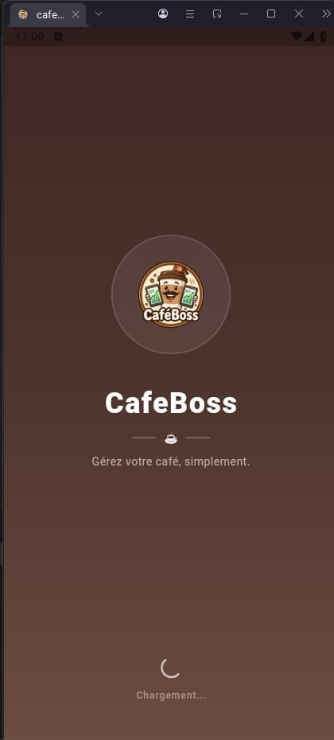
  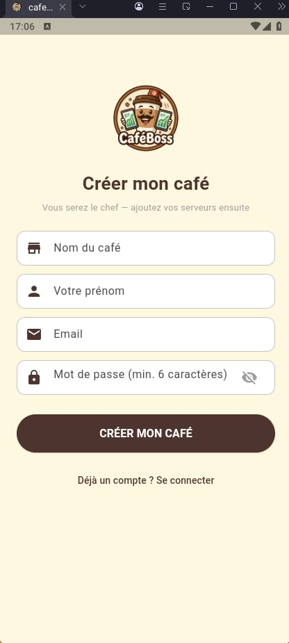
  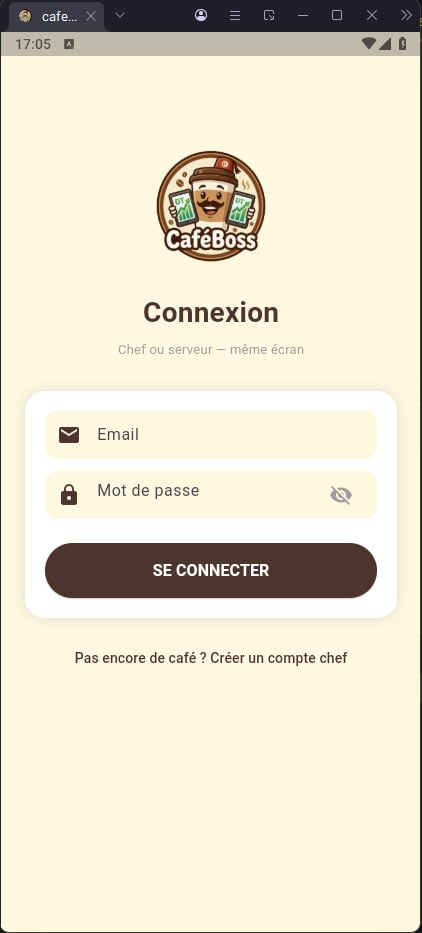
  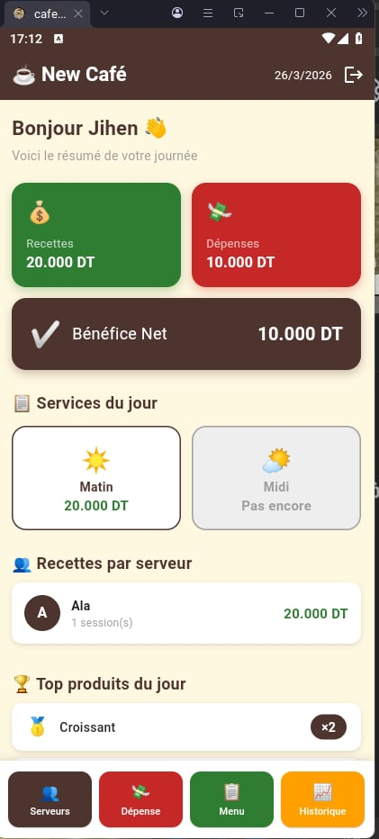
  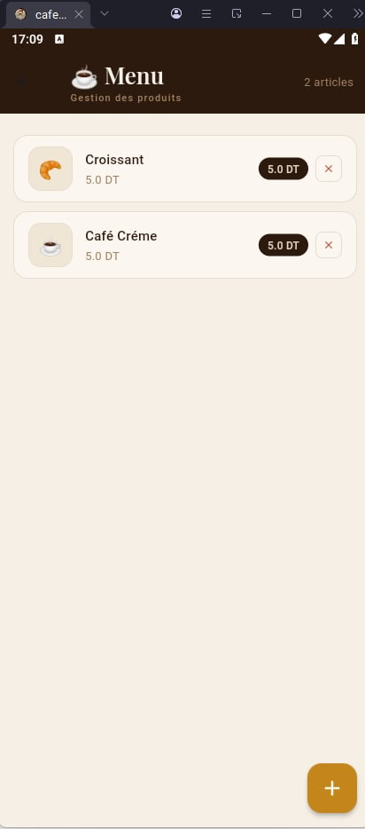
</p>

<p align="center">
  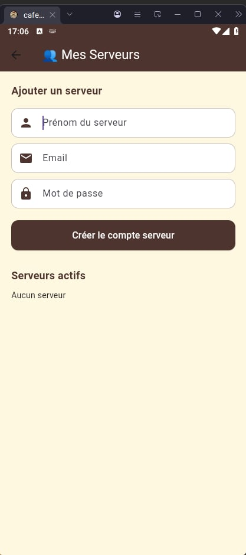
  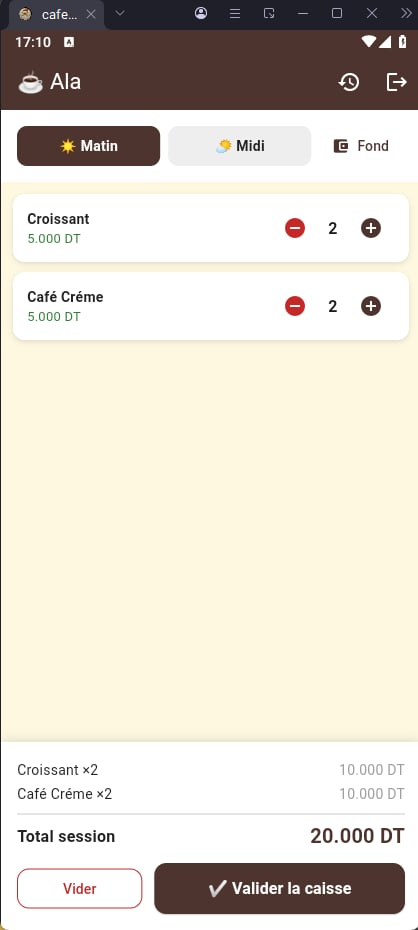
  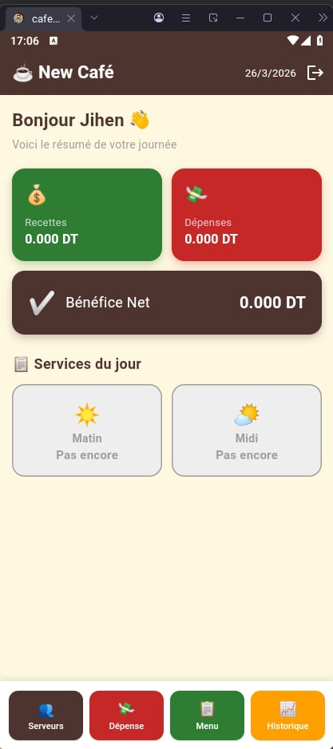
</p>
<p align="center">
  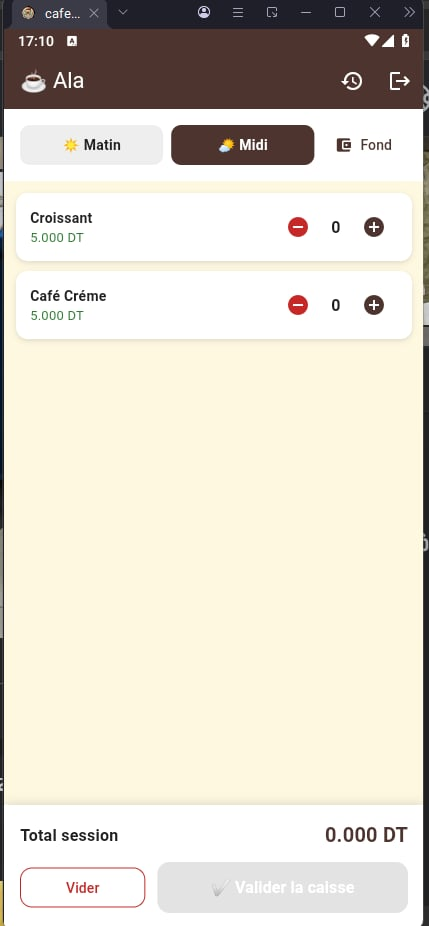
  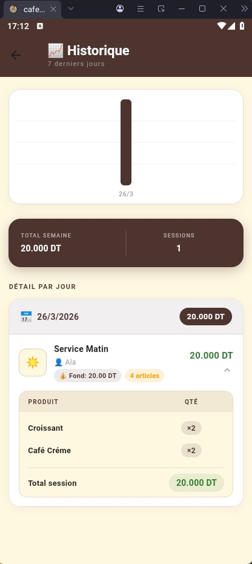
  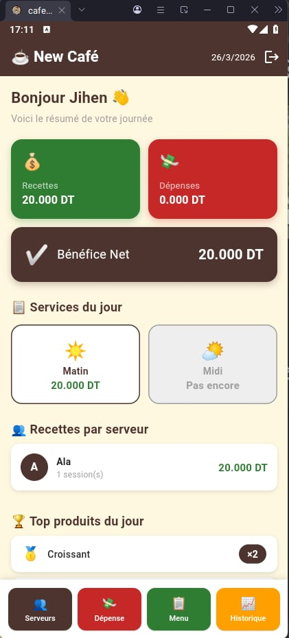
    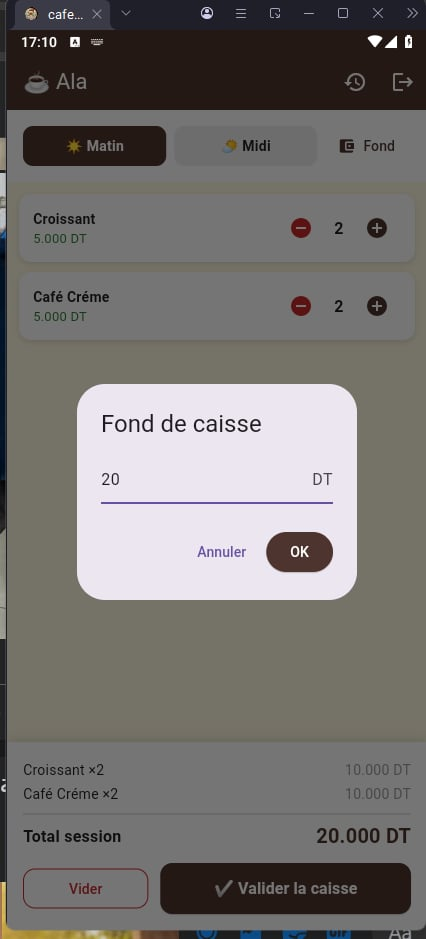
  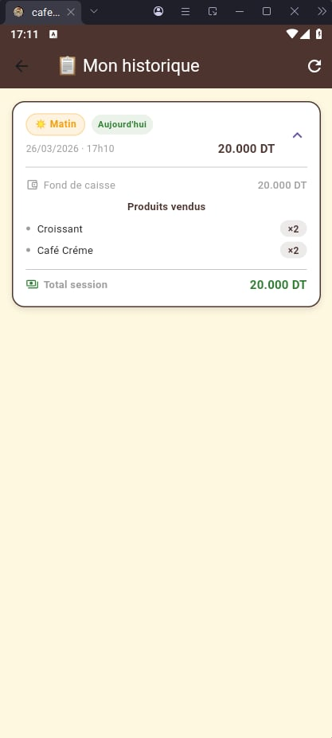
  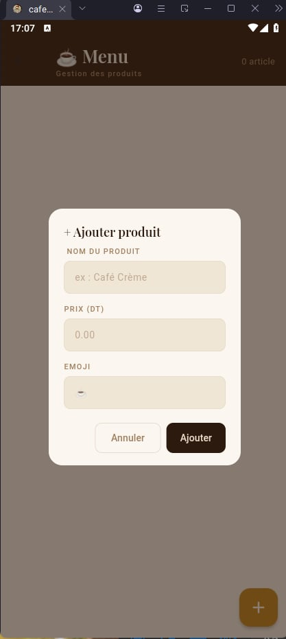
  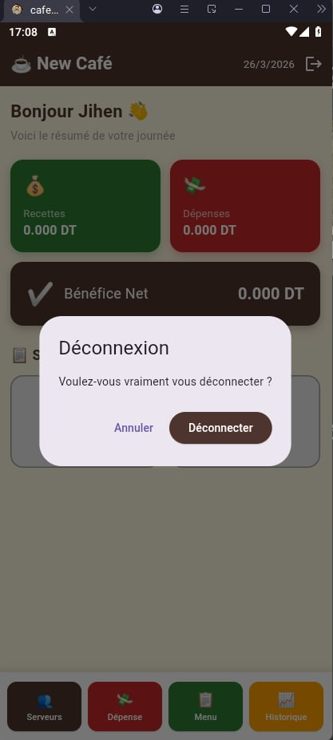
    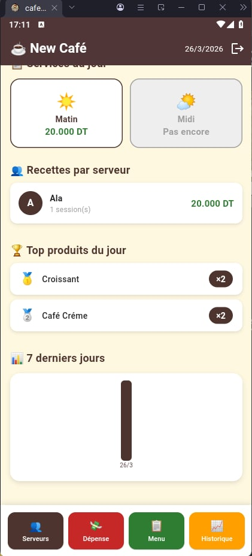
  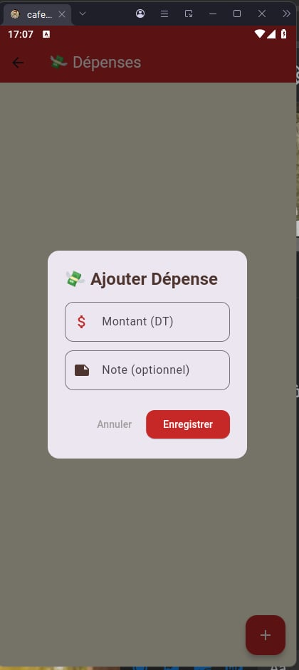
  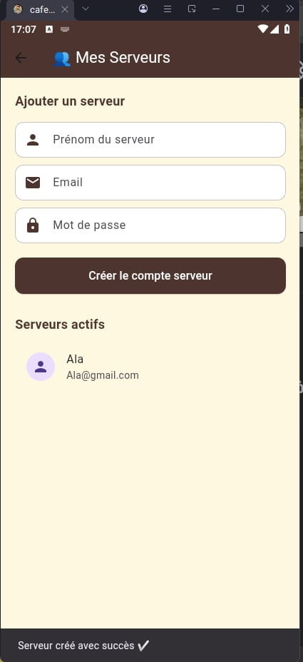
</p>


## ✨ Fonctionnalités

| Fonctionnalité | Description |
|---|---|
| 🔐 **Authentification multi-rôles** | Connexion Chef / Serveur avec Firebase Auth |
| 🏪 **Création de café** | Le chef configure son établissement et invite ses serveurs |
| 📋 **Gestion du menu** | Ajout de produits et prix en Dinars Tunisiens (DT) |
| 💰 **Caisse par serveur** | Chaque serveur gère sa propre caisse (session Matin / Midi) |
| 📊 **Dashboard temps réel** | Vue globale des ventes, dépenses et bénéfices |
| 💸 **Suivi des dépenses** | Ingrédients, salaires et autres charges |
| 🕒 **Historique détaillé** | Filtrage par jour, semaine ou mois |

---

## 🏗️ Architecture

```
CaféBoss
├── Authentification Firebase (multi-rôles)
│   ├── Chef  →  Vue globale + gestion
│   └── Serveur  →  Caisse + sessions
│
├── Architecture MVVM + Provider
│   ├── Models
│   ├── ViewModels
│   └── Views
│
└── Firebase Backend
    ├── Firebase Auth
    └── Cloud Firestore
```

### Flux multi-rôles

```
Chef crée le café
    │
    ├── Ajoute des serveurs
    ├── Consulte le dashboard global
    └── Suit les dépenses & bénéfices

Serveur se connecte
    │
    ├── Ouvre une session (Matin / Midi)
    ├── Enregistre les ventes
    └── Clôture sa caisse
```

---

## ⚡ Stack Technique

| Couche | Technologie |
|---|---|
| **UI** | Flutter 3.x + Dart |
| **State Management** | Provider |
| **Navigation** | GoRouter |
| **Base de données** | Firebase Firestore |
| **Authentification** | Firebase Auth |
| **Charts** | fl_chart |
| **Architecture** | MVVM |
| **Platform** | Android |

---

## 📱 Écrans de l'application

```
1. 💫 Splash Screen
2. 🔐 Connexion (Chef / Serveur)
3. 🏪 Création de café
4. 📊 Dashboard
5. 💰 Caisse (sessions Matin / Midi)
6. 📋 Menu
7. 💸 Dépenses
8. 🕒 Historique
```

---

## 🚀 Installation & Configuration

### Prérequis

- Flutter 3.x installé ([guide officiel](https://flutter.dev/docs/get-started/install))
- Un projet Firebase configuré
- Android Studio ou VS Code

### Étapes

```bash
# 1. Cloner le repository
git clone https://github.com/votre-username/cafeboss.git
cd cafeboss

# 2. Installer les dépendances
flutter pub get

# 3. Configurer Firebase
# → Téléchargez google-services.json depuis la console Firebase
# → Placez-le dans android/app/

# 4. Lancer l'application
flutter run
```

### Configuration Firebase

1. Créez un projet sur [Firebase Console](https://console.firebase.google.com/)
2. Activez **Firebase Auth** (email/password)
3. Activez **Cloud Firestore**
4. Téléchargez `google-services.json` et placez-le dans `android/app/`

---

## 📂 Structure du projet

```
lib/
├── core/
│   ├── constants/
│   ├── theme/
│   └── utils/
├── models/
│   ├── user_model.dart
│   ├── product_model.dart
│   ├── session_model.dart
│   └── expense_model.dart
├── services/
│   ├── auth_service.dart
│   └── firestore_service.dart
├── viewmodels/
│   ├── auth_viewmodel.dart
│   ├── dashboard_viewmodel.dart
│   └── caisse_viewmodel.dart
├── views/
│   ├── splash/
│   ├── auth/
│   ├── dashboard/
│   ├── caisse/
│   ├── menu/
│   ├── depenses/
│   └── historique/
└── main.dart
```

---

## 🔥 Firestore — Structure de la base de données

```
cafes/
└── {cafeId}/
    ├── name: string
    ├── ownerId: string
    ├── produits/
    │   └── {produitId}/
    │       ├── nom: string
    │       └── prix: number
    ├── serveurs/
    │   └── {serveurId}/
    │       └── sessions/
    │           └── {sessionId}/
    │               ├── type: "matin" | "midi"
    │               ├── ventes: array
    │               └── total: number
    └── depenses/
        └── {depenseId}/
            ├── categorie: string
            ├── montant: number
            └── date: timestamp
```

---

## 💡 Cas d'usage

> Un cafetier de la Médina de Tunis ouvre CaféBoss chaque matin. Il assigne les sessions à ses deux serveurs. En fin de journée, depuis son téléphone, il voit en un coup d'œil : **total des ventes**, **dépenses du jour**, et **bénéfice net** — sans calculette, sans carnet.

---

## 🤝 Contribuer

Les contributions sont les bienvenues ! Pour contribuer :

1. Forkez le projet
2. Créez votre branche (`git checkout -b feature/nouvelle-fonctionnalite`)
3. Committez vos changements (`git commit -m 'Ajout d'une nouvelle fonctionnalité'`)
4. Pushez (`git push origin feature/nouvelle-fonctionnalite`)
5. Ouvrez une Pull Request

---

## 📄 Licence

Ce projet est sous licence MIT. Voir le fichier [LICENSE](LICENSE) pour plus de détails.

---

## 👩‍💻 Auteure

Développée avec ❤️ pour les cafetiers tunisiens.

Vous avez un projet Flutter / Firebase ? **Contactez-moi en message privé !**

<p align="center">
  <em>CaféBoss — Parce que chaque DT compte ☕</em>
</p>
